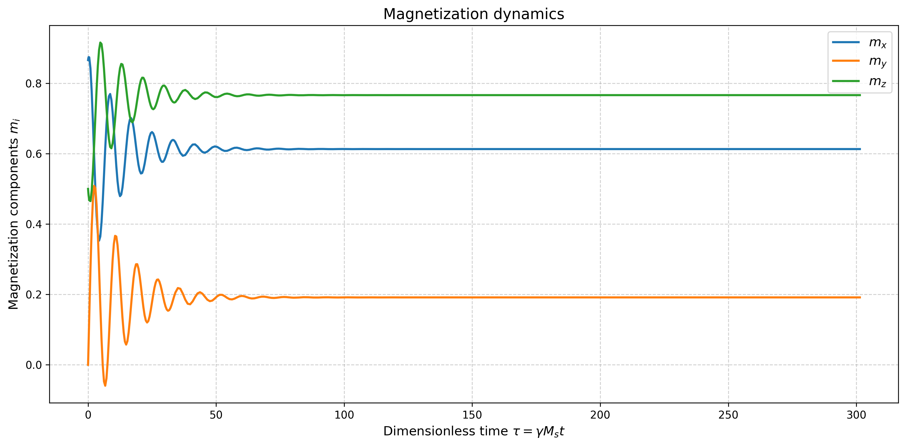
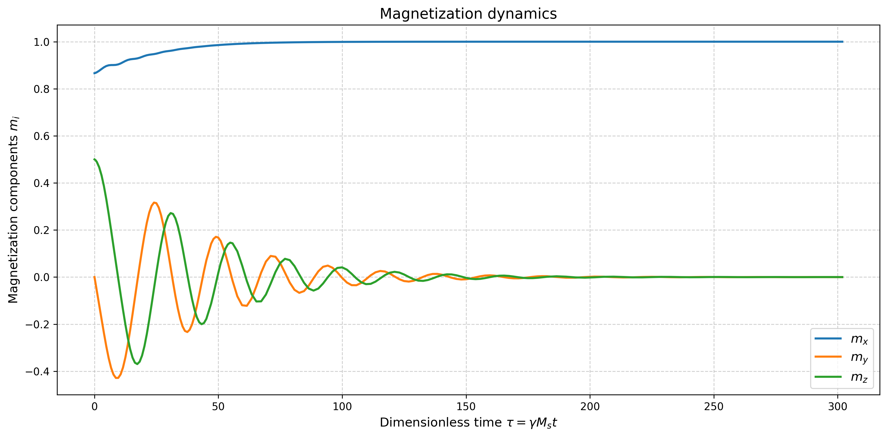

# Landau-Lifshitz-Gilbert (LLG) Equation Solver

## Описание
LLG_solver.py реализует численное решение уравнения Ландау-Лифшица-Гилберта (LLG) для моделирования динамики намагниченности в ферромагнитных материалах.

$$\frac{dm}{dt} = - \gamma (m \times H_{eff}) - \alpha \gamma (m \times (m \times H_{eff}))$$

где $$m = \frac{M}{M_s}$$ - намагниченность (безразмерная, norm(m) = 1), $$H_{eff}$$ - эффективное поле [G]  
$$\gamma$$ - гиромагнитное отношение [rad/(s * G)], $$\alpha$$ - параметр затухания (безразмерный).

Программа поддерживает различные типы эффективных полей, включая внешнее поле, размагничивающее поле и анизотропию. 

## Замечание о реализации
Так как величина $$\gamma$$ имеет большой порядок (~ $$10^7$$), а отрезок времени, на котором рассматривается решение, наоборот, мал, 
для лучшей вычислительной устойчивости была рассмотрена безразмерная форма уравнения ЛЛГ:

$$\frac{dm}{d\tau} = - (m \times h_{eff}) - \alpha (m \times (m \times h_{eff}))$$  
где $$\tau = \gamma M_s t$$ - безразмерное время, $$h_{eff} = \frac{H_{eff}}{M_s}$$ - безразмерное эффективное поле

В такой постановке начальный шаг по времени имеет порядок не $$10^{-12}$$, a $$10^{-2}$$

## Численный метод
Используется метод Мерсона (адаптивный Рунге-Кутты 4-5 порядка). В зависимости от оценки локальной погрешности он адаптивно подбирает шаг. 
Данный метод был выбран из соображения, что при малых параметрах $$\alpha$$ затухание происходит медленно, поэтому в начале исследуемого отрезка по времени 
частота колебаний вектора намагниченности высока и требуется значительно меньший шаг для корректной визуализации решения. Если же взять малый постоянный шаг, 
то на отрезке, где колебаний меньше, это значительно увеличит вычислительные затраты.  
Также на каждом шаге алгоритма вектор намагниченности проецировался на единичную окружность (для сохранения нормы).

## Результаты
Было проведено несколько тестов с различными конфигурациями (см. main.py).  
В качестве начальной точки было взято положение  $$m_0 = [cos(\theta), 0, sin(\theta)],\ \theta = \frac{\pi}{6}$$.
(Для других начальных точек метод также сходился).
### Воздействие различных сил
#### 1. Внешнее поле  
Конфигурация: H = [800, 250, 1000] G, $$\alpha = 0.1$$  
Нормируя вектор H получим направление: [0.61312133 0.19160042 0.76640167] (ожидаемый результат - m направлено также)

#### 2. Поле размагничивания  
Конфигурация: N = [0.5, 0.5, 0.0] (Цилиндр, бесконечный водь оси Z), $$\alpha = 0.01$$  
Ожидаемый результат: m = [0, 0, 1]
.png)
#### 3. Анизотропия  
Конфигурация: $$K_1, K_2$$ для железа, $$\alpha = 0.1$$  
Ожидаемый результат: m = [1, 0, 0] и его перестановки

### Влияние различных параметров затухания
Рассмотрим пример с полем размагничивания с параметрами: N = [0.0, 0.0, 1.0] (Плоскость, бесконечная вдоль XY), $$\alpha = 0.1, ..., 0.0001$$  
Ожидаемый результат: m = [любое, любое, 0]  
#### 1. $$\alpha = 0.1$$
-1.png)
#### 2. $$\alpha = 0.01$$
-2.png)
#### 3. $$\alpha = 0.001$$
-3.png)
#### 4. $$\alpha = 0.0001$$
-4.png)

**Можно сделать вывод, что при уменьшении коэффициента затухания на порядок, время релаксации увеличивается примерно на порядок.**

